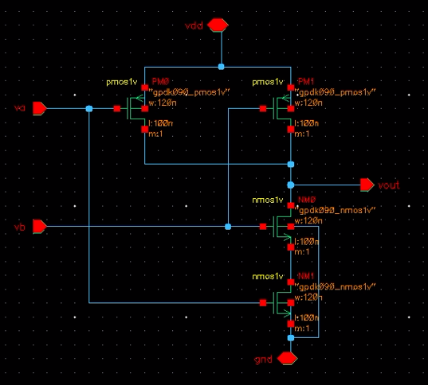
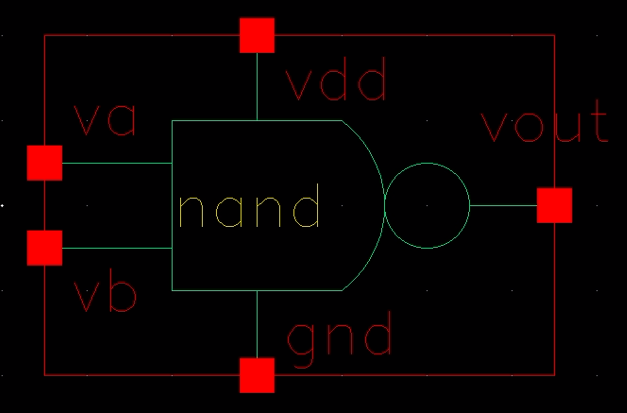
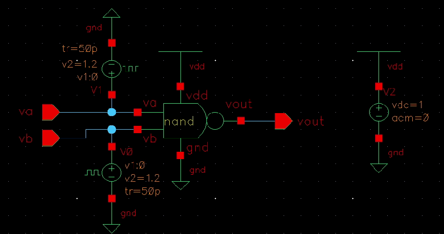
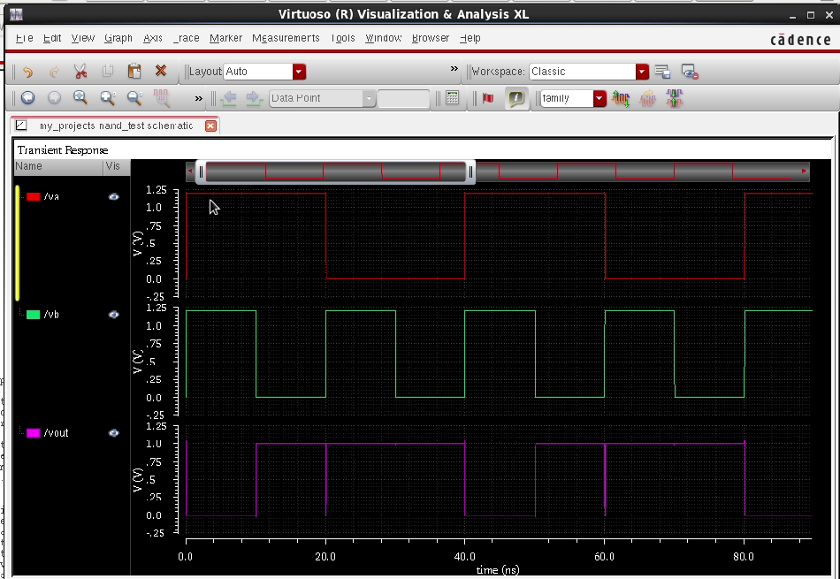
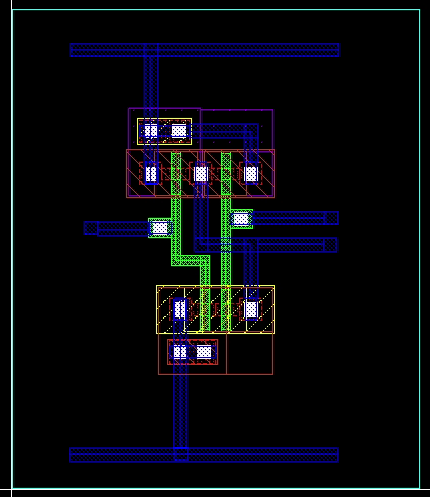
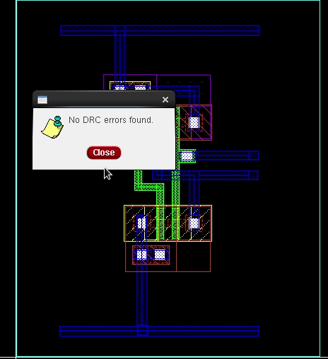
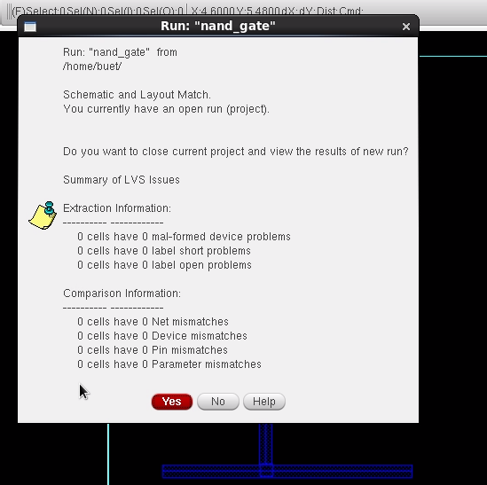
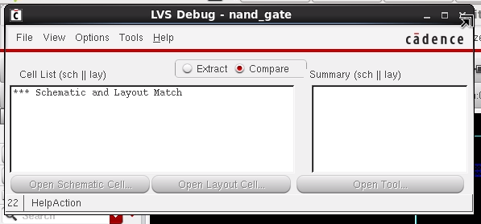
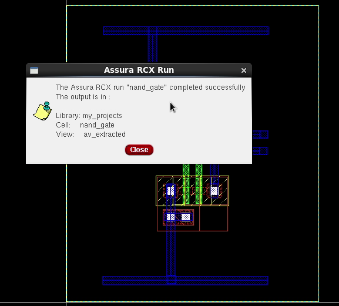
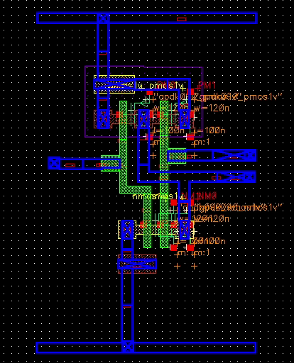

# nand-gate-cadence-project
CMOS NAND Gate design using Cadence Virtuoso including schematic design, simulation and layout verification (DRC, LVS REX).

# CMOS NAND Gate Design using Cadence Virtuoso
CMOS NAND Gate design implemented using Cadence Virtuoso including schematic design, symbol creation, simulation, layout implementation and physical verification using DRC, LVS and REX.

# 1. Introduction
Digital logic gates are the fundamental building blocks of digital integrated circuits. Among all logic gates, the NAND gate is considered a universal gate because any digital logic circuit can be implemented using only NAND gates.

In CMOS technology, logic gates are implemented using complementary MOS transistors, namely NMOS and PMOS. CMOS logic provides several advantages such as low static power consumption, high noise immunity, and high integration capability.

The objective of this project is to design a CMOS NAND gate using Cadence Virtuoso and verify its functionality through simulation and physical verification steps including DRC, LVS and REX.

## NAND Gate Truth Table

| A | B | Y |
|---|---|---|
| 0 | 0 | 1 |
| 0 | 1 | 1 |
| 1 | 0 | 1 |
| 1 | 1 | 0 |

Boolean Expression

Y = (A · B)'

# 2. Schematic Design
The schematic of the CMOS NAND gate was designed using Cadence Virtuoso schematic editor. The design consists of two PMOS transistors connected in parallel and two NMOS transistors connected in series.

The PMOS network forms the pull-up network connected to VDD while the NMOS network forms the pull-down network connected to ground.

Inputs A and B are connected to the gates of both PMOS and NMOS transistors, while the output node Y is taken from the connection between pull-up and pull-down networks.

## Schematic Diagram

# 3. Symbol Creation
After completing the schematic design, a symbol view of the NAND gate was created in Cadence Virtuoso. The symbol allows the NAND gate to be reused as a hierarchical block in higher level circuit designs.

The symbol includes two input pins (A and B) and one output pin (Y).

## Symbol View

# 4. Testbench Design
To verify the functionality of the NAND gate, a testbench circuit was created. Pulse voltage sources were applied to the inputs A and B in order to generate all possible input combinations.

The output node was monitored to verify correct NAND logic operation.

## Testbench Circuit

# 5. Transient Simulation
Transient analysis was performed using Cadence Spectre simulator. The simulation confirms that the output behaves according to the NAND logic truth table.

When both inputs are HIGH, the output becomes LOW. For all other input combinations, the output remains HIGH.

## Simulation Waveform

# 6. Layout Design
After verifying the schematic through simulation, the physical layout of the CMOS NAND gate was created using Cadence Virtuoso Layout Editor.

The PMOS transistors were placed inside the N-well region while NMOS transistors were placed in the P-substrate. Proper routing was implemented using metal layers while ensuring that all technology design rules were followed.

## Layout View

# 7. Design Rule Check (DRC)
Design Rule Check was performed to verify that the layout follows all manufacturing design rules defined by the process technology.

The layout passed all design rule checks successfully with no violations.

## DRC Result

DRC Status: Successful

# 8. Layout vs Schematic (LVS)
LVS verification was performed to ensure that the layout implementation matches the schematic design.

The LVS comparison confirmed that the number of devices, connectivity and device parameters match exactly between the layout and schematic.

## LVS Result

LVS Status: Layout and Schematic Matched
## LVS and Schematic Match

# 9. Parasitic Extraction (REX)
Parasitic extraction was performed to extract parasitic resistances and capacitances from the layout. These parasitic elements represent the real physical effects present in the fabricated circuit.

After extraction, the extracted view was generated successfully without any errors.

## REX Extraction

REX Status: Extraction Successful
## Extracted View

# 10. Conclusion
The CMOS NAND gate was successfully designed and verified using the Cadence Virtuoso design environment. The project followed the complete custom IC design flow starting from schematic design, symbol creation and simulation to layout implementation and physical verification using DRC, LVS and REX.

The successful verification confirms that the layout implementation correctly represents the schematic design and follows all technology design rules.

# Author
Abhijit Wankhede Analog Layout Engg. / Abhijit Cadence tutorial
